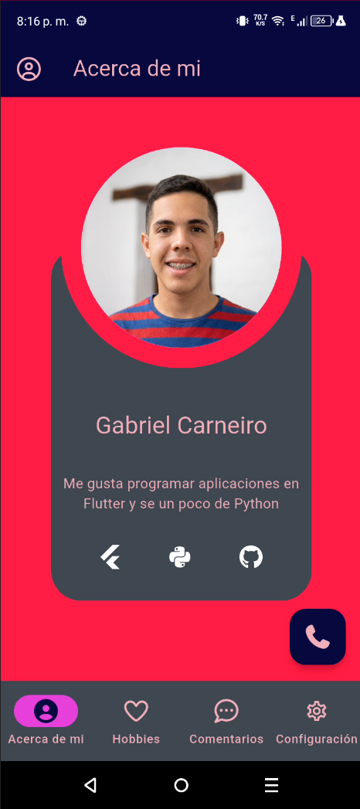
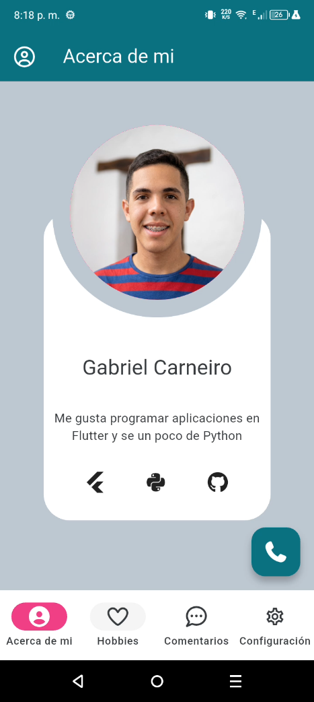
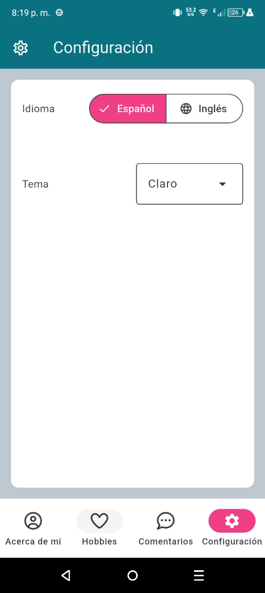

# Portafolio Gabriel

Un portafolio personal desarrollado en Flutter, con soporte para cambio de idioma, cambio de tema y una interfaz de navegación por pestañas.

## 👥 Autor

- [@Acthel12](https://github.com/Acthel12)


## 🔎 Descripción

Esta app muestra una presentación personal con las siguientes secciones:

- **Acerca de mí**: Perfil, bio y accesos rápidos.
- **Hobbies**: Lista de intereses con tarjetas interactivas.
- **Comentarios**: Sección para dejar y ver comentarios locales.
- **Configuración**: Cambiar idioma y tema de la aplicación.

## 🚀 Características

- Soporte de idioma español / inglés.
- Tema claro y oscuro.
- Navegación con `PageView` y `NavigationBar`.
- Comentarios locales guardados en memoria durante la sesión.
- Uso de iconos con `font_awesome_flutter`.
- Botón flotante expandable para acciones rápidas.

## 📱 Demostración

| AboutMeDark | AboutMeLight | ConfigLight |
| :---: | :---: | :---: |
|  |  |  |


## 🧩 Dependencias

- `flutter_expandable_fab`
- `font_awesome_flutter`
- `url_launcher`
- `flutter_launcher_icon`

## 💻 Requisitos

- Flutter SDK compatible con `>=3.11.5`
- Android Studio / VS Code / Xcode según plataforma de destino

## ▶️ Ejecutar la aplicación

1. Instalar dependencias:

```bash
flutter pub get
```

2. Ejecutar en un dispositivo o emulador:

```bash
flutter run
```

Creado para mostrar un portafolio personal con Flutter y diseño moderno.
